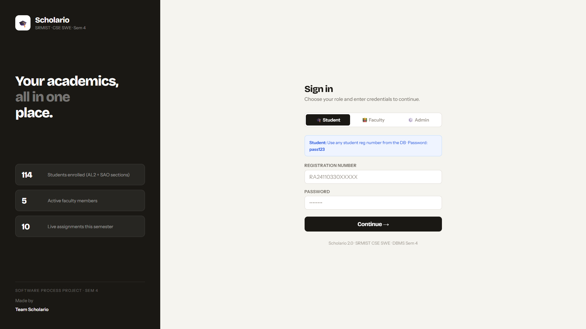
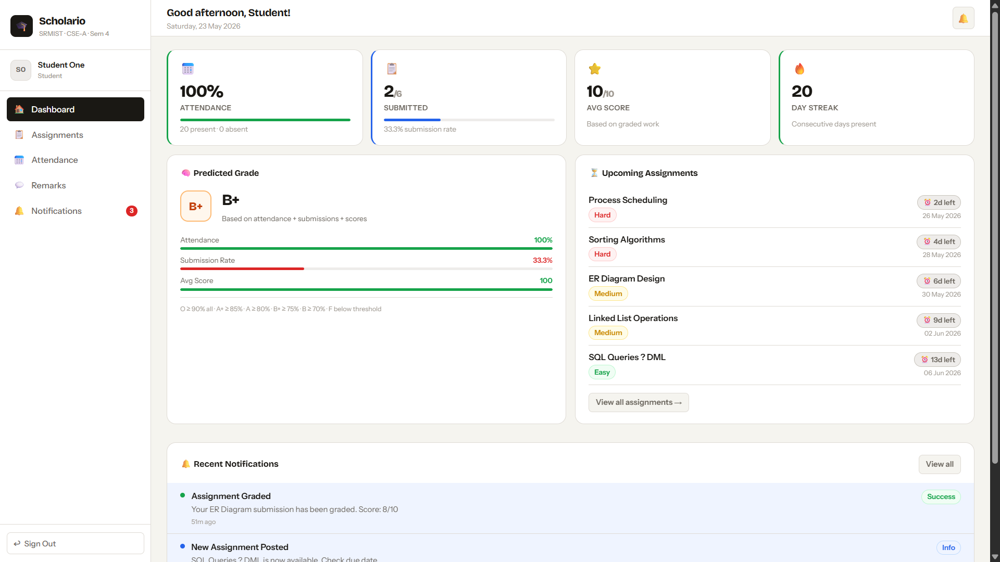
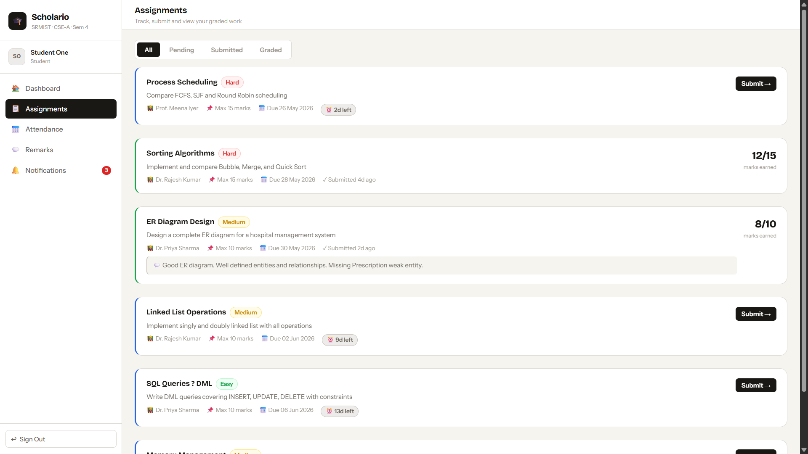
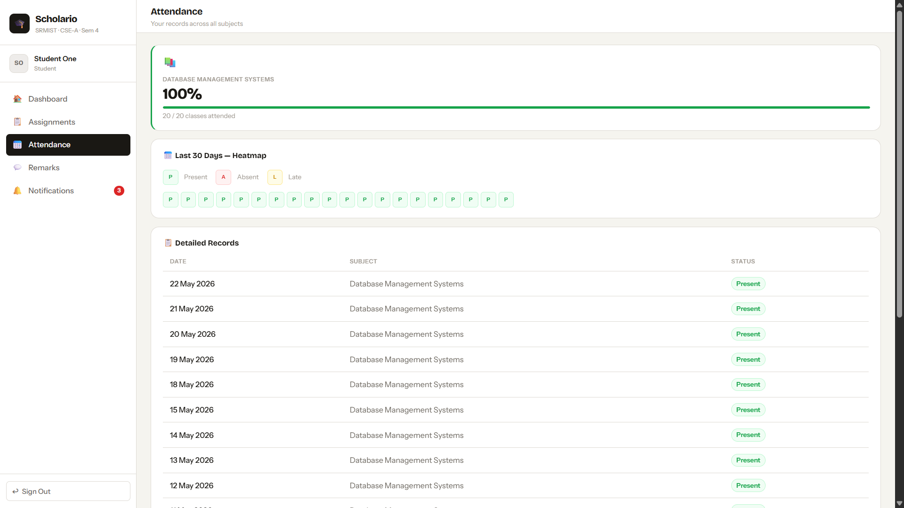
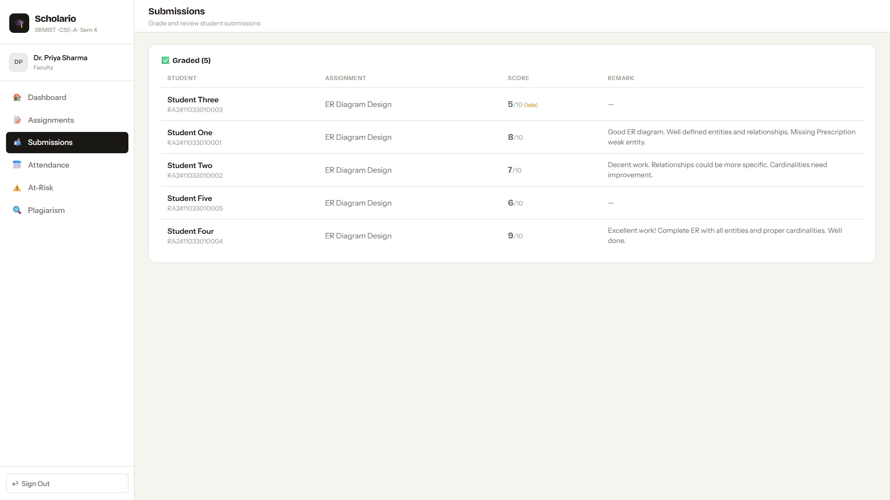
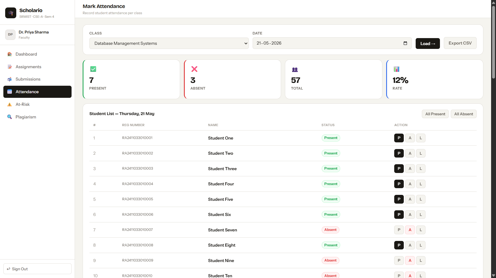
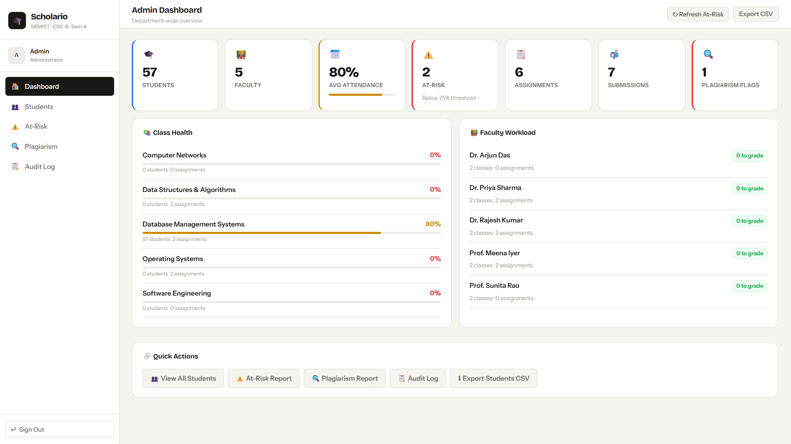
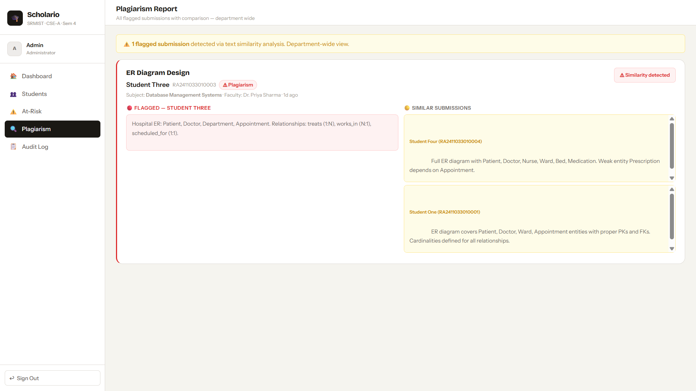
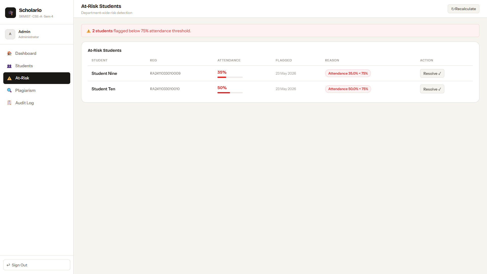
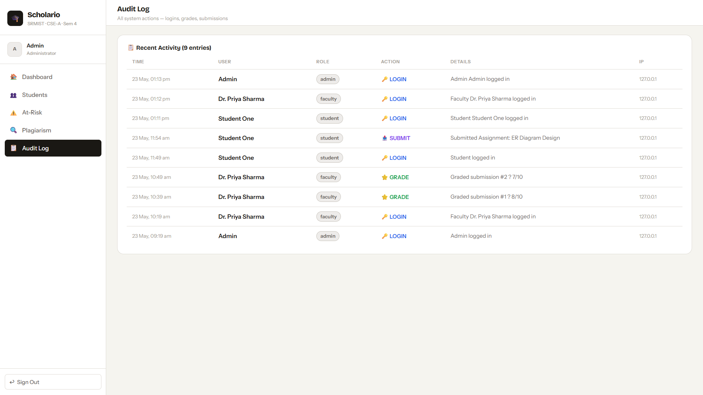

<div align="center">



# Scholario

**A full-stack college academic management system**  
SRMIST · CSE-A · Semester 4 · DBMS Project


</div>

---

## 📸 Preview

<table>
  <tr>
    <td width="50%">
      
      <p align="center"><b>Student Dashboard</b> — Grade predictor, streak, upcoming assignments</p>
    </td>
    <td width="50%">
      
      <p align="center"><b>Assignments</b> — Countdown timers, difficulty tags, inline remarks</p>
    </td>
  </tr>
  <tr>
    <td width="50%">
      
      <p align="center"><b>Attendance</b> — Heatmap grid + subject-wise progress bars</p>
    </td>
    <td width="50%">
      
      <p align="center"><b>Faculty Submissions</b> — Graded list with late penalty and remarks</p>
    </td>
  </tr>
  <tr>
    <td width="50%">
      
      <p align="center"><b>Live Attendance Marking</b> — P / A / L toggle per student, saves instantly</p>
    </td>
    <td width="50%">
      
      <p align="center"><b>Admin Dashboard</b> — Department health, faculty workload, quick actions</p>
    </td>
  </tr>
  <tr>
    <td width="50%">
      
      <p align="center"><b>Plagiarism Detection</b> — Side-by-side text similarity comparison</p>
    </td>
    <td width="50%">
      
      <p align="center"><b>At-Risk Detection</b> — Auto-flagged students below 75% attendance</p>
    </td>
  </tr>
  <tr>
    <td width="50%">
      
      <p align="center"><b>Audit Log</b> — Every login, grade, and submission timestamped</p>
    </td>
    <td width="50%">
      
      <p align="center"><b>Login</b> — Role-based access for Student, Faculty, and Admin</p>
    </td>
  </tr>
</table>

---

## ✨ Features

### 🎒 Student Portal
| Feature | Description |
|---------|-------------|
| **AI Grade Predictor** | Calculates predicted grade (O / A+ / A / B+ / B / F) live from attendance × submission rate × avg score |
| **Assignment Submissions** | Text-based submission with real-time countdown timer, late detection, and plagiarism check on submit |
| **Attendance Heatmap** | 30-day heatmap grid (green = present, red = absent, yellow = late) with per-subject breakdown |
| **Remark Sentiment** | Faculty feedback with auto-detected sentiment — positive, neutral, or needs work |
| **Day Streak** | 🔥 Consecutive days present tracked and shown as a streak counter |
| **Notifications** | Real-time alerts for grades, new assignments, and attendance warnings |

### 👩‍🏫 Faculty Portal
| Feature | Description |
|---------|-------------|
| **Live Attendance** | P / A / L toggle per student — saves to DB instantly, shows live present/absent count |
| **Submission Grading** | Grade with marks + remark in a single modal, student gets notified automatically |
| **Plagiarism Detection** | Text similarity engine compares all submissions for same assignment — flags copies with % similarity |
| **Late Penalty Tracker** | Auto-detects if submitted after due date, calculates effective marks after configured penalty |
| **At-Risk Detection** | Flags students below 75% attendance or 50% submission rate — shown as a dedicated report |
| **Assignment Analytics** | Per-assignment submission rate bar showing how many of total students have submitted |

### ⚙️ Admin Portal
| Feature | Description |
|---------|-------------|
| **Department Dashboard** | Class-wise attendance %, submission rates, at-risk count, plagiarism flags — all in one view |
| **Faculty Workload Balancer** | Shows pending-to-grade count per faculty so admin can spot who's overloaded |
| **Full Student Roster** | Searchable table with reg number, attendance %, submissions, last active, and at-risk status |
| **Audit Log** | Every login, grade, and submission is stored with user, role, action, detail, and IP address |
| **CSV Export** | One-click download for student and attendance data |

---

## 🗄️ Database Design

**11 tables** covering the full academic workflow:

```
users          — all users (students, faculty, admin) with role-based access
class          — subjects and their assigned faculty
student        — student profile linked to user and class
teacher        — faculty profile with department and designation
assignment     — assignments with difficulty, due date, max marks
submission     — student submissions with late flag, penalty, plagiarism flag
remark         — faculty feedback per submission
attendance     — daily attendance per student per class (unique constraint prevents duplicates)
notification   — per-user alerts (info / warning / success / urgent)
audit_log      — timestamped record of every system action
at_risk        — flagged students with reason, attendance %, resolution status
```

**Key design decisions:**
- `submission.plagiarism_flag` stored at write time — no repeated scanning on every read
- `submission.effective_marks` pre-computed after penalty — clean separation from raw marks
- `UNIQUE KEY (student_id, class_id, date)` on attendance — database-level protection against double marking
- `at_risk` is a separate table so flags can be individually resolved without touching student data

---

## 🚀 Setup

### Prerequisites
- Python 3.10+
- MySQL 8.0+

### 1. Clone the repo
```bash
git clone https://github.com/vansh-gg/Scholario.git
cd Scholario
```

### 2. Install Python dependencies
```bash
pip install fastapi uvicorn mysql-connector-python python-multipart
```

### 3. Set up the database
Open MySQL and run:
```sql
source path/to/schema.sql
```
Or from your terminal:
```bash
mysql -u root -p < schema.sql
```

### 4. Set your database password
Open `main.py` and find the `db()` function. Update the password fallback to your MySQL password:
```python
password=os.getenv("DB_PASSWORD", "your_password_here"),
```
Or create a `.env` file (copy from `.env.example`) and set `DB_PASSWORD=your_password`.

### 5. Run the backend
```bash
uvicorn main:app --reload
```

### 6. Open in browser
Go to **http://localhost:8000**

---

## 🔑 Demo Credentials

| Role    | Login ID               | Password     |
|---------|------------------------|--------------|
| Student | `RA2411033010001`      | `pass123`    |
| Faculty | `FAC001`               | `faculty123` |
| Admin   | `ADMIN001`             | `admin123`   |

Any student reg number from `RA2411033010001` to `RA2411033010020` works with `pass123`.

---

## 📁 Project Structure

```
Scholario/
│
├── main.py                    # FastAPI backend — all API routes and DB logic
├── schema.sql                 # MySQL schema + anonymized demo seed data
│
├── index.html                 # Login page (Student / Faculty / Admin)
│
├── student-dashboard.html     # Grade predictor, stats, streak, notifications
├── student-assignments.html   # Submit work, countdown timers, view grades
├── student-attendance.html    # Heatmap + subject-wise attendance bars
├── student-remarks.html       # Faculty feedback with sentiment indicator
├── student-notifications.html # All alerts and updates
│
├── faculty-dashboard.html     # Submission analytics, workload overview
├── faculty-assignments.html   # Create assignments, auto-notify students
├── faculty-submissions.html   # Grade submissions with marks + remarks
├── faculty-attendance.html    # Live P / A / L marking per student
├── faculty-atrisk.html        # Students below attendance/submission threshold
├── faculty-plagiarism.html    # Flagged submissions with side-by-side diff
│
├── admin-dashboard.html       # Department-wide health and workload
├── admin-students.html        # Full searchable student roster
├── admin-atrisk.html          # Resolve at-risk flags
├── admin-plagiarism.html      # Department-wide plagiarism report
├── admin-audit.html           # Full system audit trail
│
├── shared.js                  # Shared JS utilities — auth, API calls, badges
├── style.css                  # Full design system — light theme
│
├── screenshots/               # App screenshots for README
├── .env.example               # Environment variable template
├── .gitignore
└── README.md
```

---

## 🛠️ Tech Stack

| Layer    | Technology |
|----------|-----------|
| Backend  | Python · FastAPI · Uvicorn |
| Database | MySQL 8.0 |
| Frontend | Vanilla HTML · CSS · JavaScript |
| Fonts    | Bricolage Grotesque · Instrument Sans |

No frontend framework — fully custom CSS and vanilla JS.

---

## 📌 API Reference

| Method | Endpoint | Description |
|--------|----------|-------------|
| `POST` | `/api/login` | Authenticate user — returns role, ID, and profile |
| `GET` | `/api/student/{id}/dashboard` | Stats, grade prediction, streak, notifications |
| `GET` | `/api/student/{id}/assignments` | All assignments with submission status and countdown |
| `POST` | `/api/student/submit` | Submit assignment — runs plagiarism check on save |
| `GET` | `/api/student/{id}/attendance` | Attendance records + per-subject percentages |
| `GET` | `/api/student/{id}/remarks` | Graded submissions with faculty remarks |
| `GET` | `/api/faculty/{id}/dashboard` | Assignment analytics, pending grades, at-risk count |
| `GET` | `/api/faculty/{id}/submissions` | All submissions to review and grade |
| `PUT` | `/api/faculty/grade/{sub_id}` | Save marks and remark, notifies student |
| `GET` | `/api/faculty/{id}/attendance/{class_id}/{date}` | Student list for attendance marking |
| `POST` | `/api/faculty/attendance` | Save attendance for a class and date |
| `POST` | `/api/faculty/assignment` | Create assignment — auto-notifies all students |
| `GET` | `/api/faculty/{id}/at-risk` | Students below threshold for that faculty |
| `GET` | `/api/admin/dashboard` | Department-wide stats, class health, workload |
| `GET` | `/api/admin/students` | Full student roster with attendance and status |
| `GET` | `/api/admin/at-risk` | All unresolved at-risk flags |
| `GET` | `/api/admin/plagiarism` | All flagged submissions with comparison data |
| `GET` | `/api/admin/audit-log` | Full timestamped action history |
| `GET` | `/api/export/{table}` | CSV export for any allowed table |

---

<div align="center">
<sub>Scholario · SRMIST CSE-A · DBMS Semester 4 Project</sub><br>
<sub>Built by <strong>Vansh Ghai</strong> · SRMIST CSE-A · Batch 2024–28</sub>
</div>
